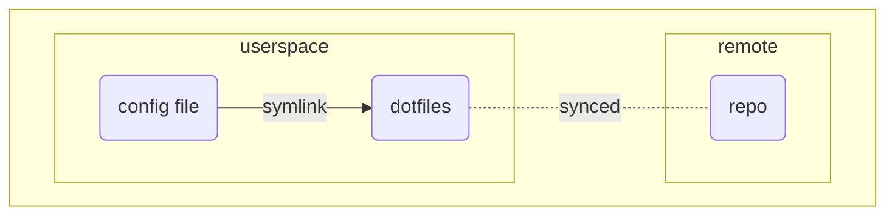

```
    _       _     __         __ _
 __| | ___ | |_  / _|  ___  / _` | ___
/ _` |/ _ \|  _||  _| |___| \__. |/ _ \
\__/_|\___/ \__||_|         |___/ \___/

dotf-go - dotfiles handler written in go
```
dotf provides basic file operations to manage dotfiles locally using a single git repository. It
also includes an (optional) tray process to handle timely synchronization to a remote.

Typically one would use a single git repository and a bunch of symlinks to facilitate this, and that
is essentially what this tool conveniently assists with.

<!-- Like everyone else I also have a ton of config files that I want to reuse and as it turned out -->
<!-- I also have multiple systems across which I want to reuse whole or parts of dotfiles. From that this -->
<!-- small and fun project came to life. -->

The project consists of the following:
- `dotf-cli` is a command-line tool to manage dotfiles and their relationship between the repository
    and where the file is placed in userspace (typically `${HOME}`) using symlinks.
- `dotf-tray` is a systray-based application that facilitates interval-based synchronization of the
    dotfiles folder with the remote.

This is the basic mental model:


The directory structure in `dotfiles` is a replica of that found in userspace.

## Usage
### CLI commands
```
add        <file/dir>                           Move file/dir from userspace to dotfiles.
install    <file/dir>                           Install file/dir from dotfiles into userspace.
migrate    <dotfiles-dir>  <userspace-dir>      Migrate symlinks on changed dotfiles location.
revert     <file/dir>                           Revert file to original location in userspace.
sync       -                                    Sync with remote using merge strategy.
setup      -                                    Create a sensible default configuration.
```

### Flags
```
dotf --help                     Show general help
dotf --config <path>            Use <path> to dotf config file
dotf <command> --help           Get help for specific <command>
dotf install --external <path>  Install dotfile using a different folder as relative root
```

### Examples

Add folder recursively to dotfiles
```
$ pwd
$ ~/.config/
$ dotf add i3
```

Revert folder recursively to original location
```
$ pwd
$ ~/.config/
$ dotf revert i3

// or

$ pwd
$ ~/.dotfiles/.config/
$ dotf revert i3
```

Start the tray application
```
dotf-tray
```

## Dependencies
Arch: `pacman -Ss go git gcc libayatana-appindicator`

Ubuntu: `apt-get install go git gcc libgtk-3-dev libayatana-appindicator3-dev`

## Installation
It is necessary that your local Go env is setup properly. Neither of the binaries are dependend on
each other so one can be used without the other. To install dotf-tray all dependencies are required,
otherwise you can skip the appindicator/gtk3 part.

`make install-cli` builds and installs only dotf-cli.

`make install-tray` builds and installs only dotf-tray.

`make install` builds and installs both binaries.

## Setup
- Prepare a dotfiles folder as a git repostiory e.g. `$HOME/dotfiles/` and make sure it syncs with
    the remote using SSH.
- Create a dotf configuration file either by following the below description or by using `dotf setup`.

### Dotf configuration
Configuration is done using a file: `${HOME}/.config/dotf/config`.

An example of how you might setup it up:
```
userspacedir        = ~/
dotfilesdir         = ~/dotfiles
syncdir             = ~/dotfiles
autosync            = false
syncinterval        = 1200
```

